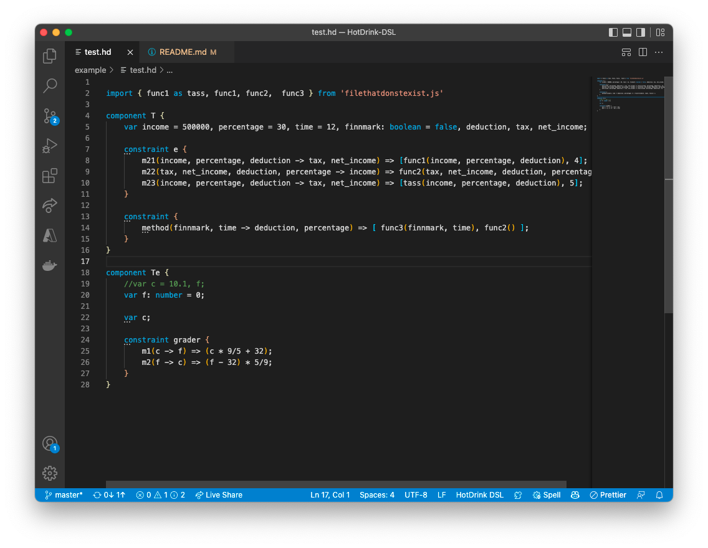
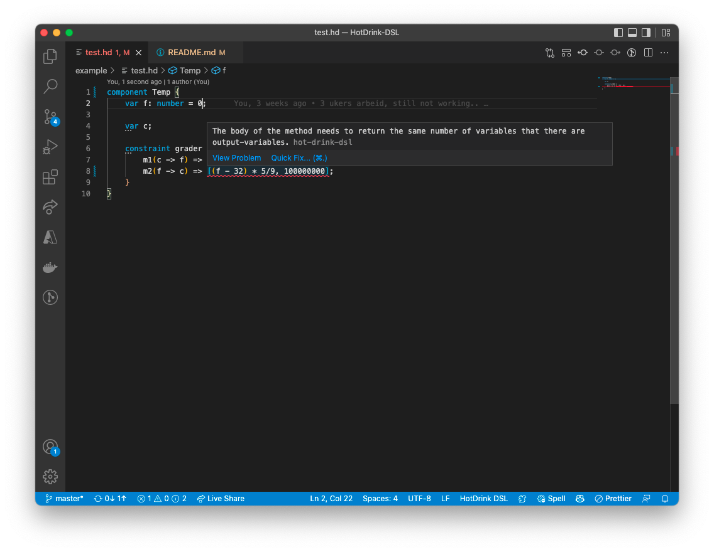
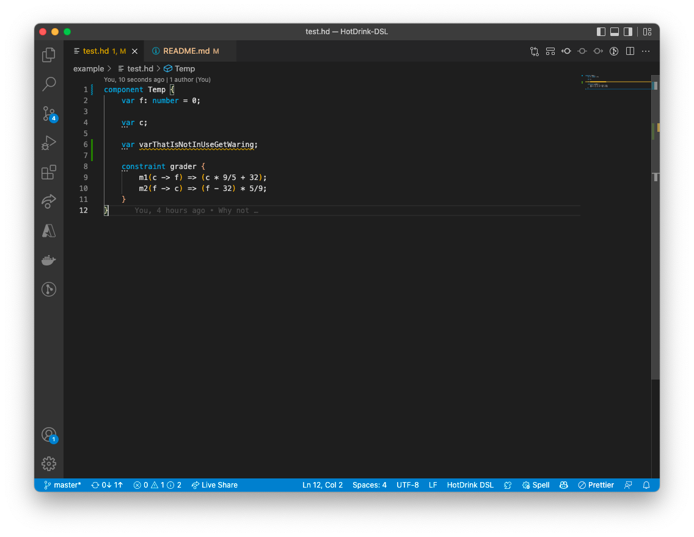
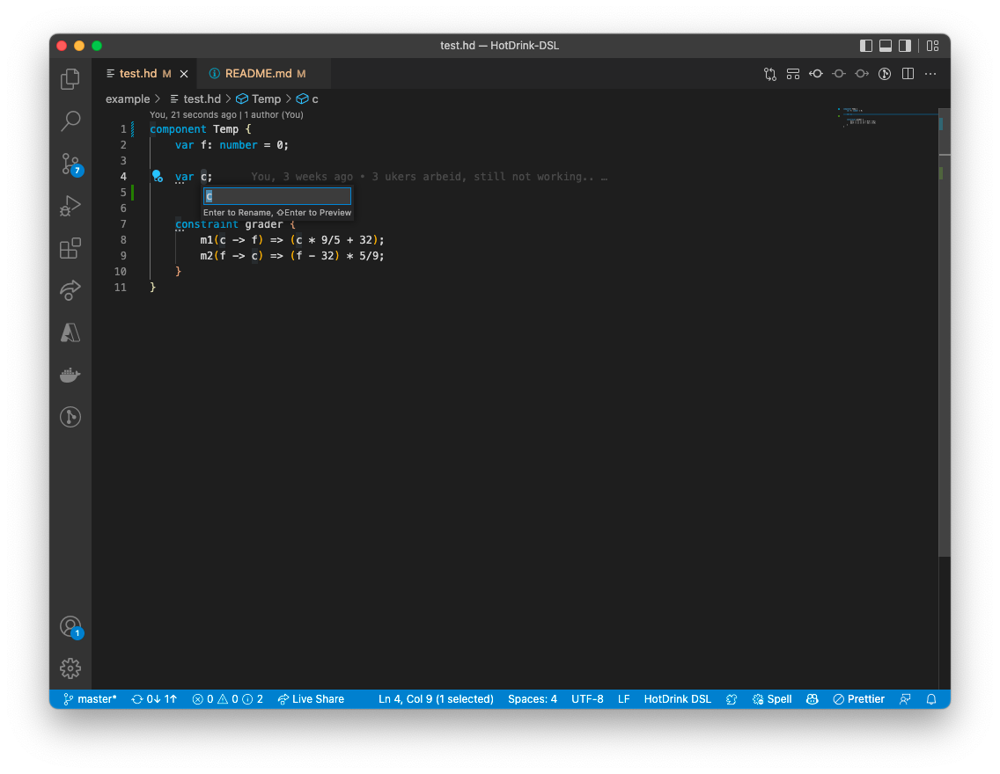
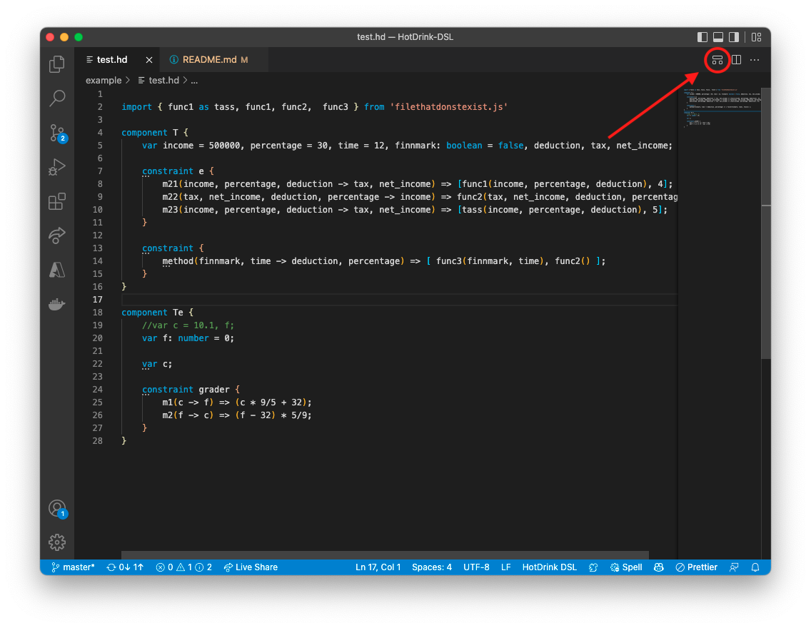
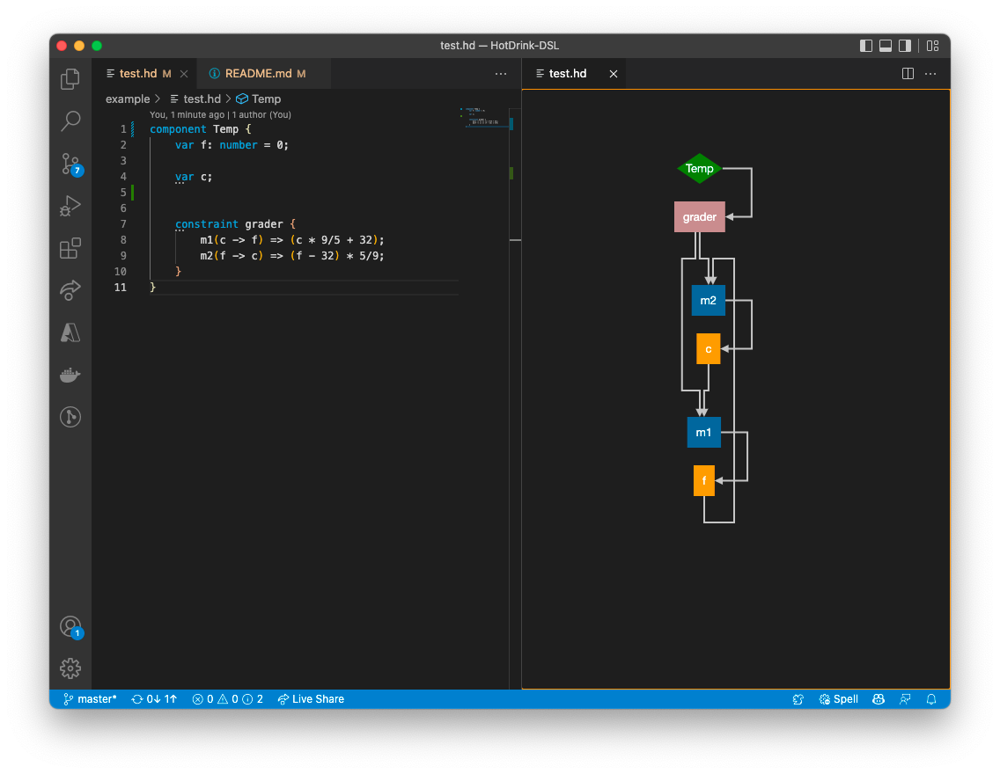
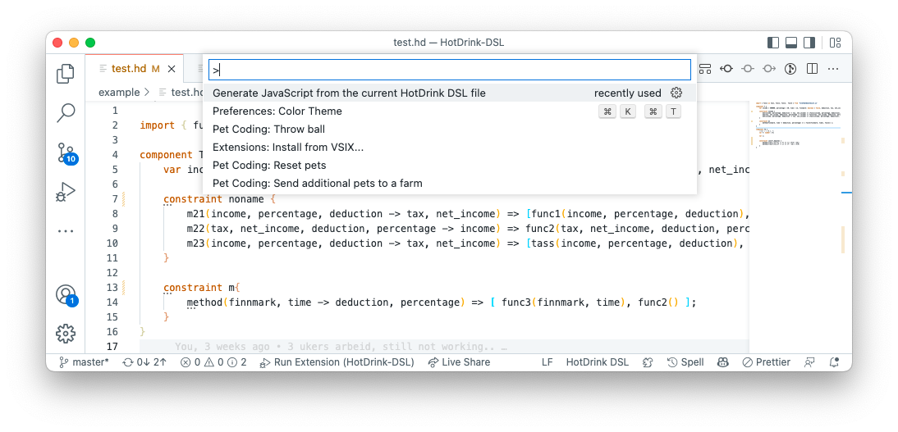
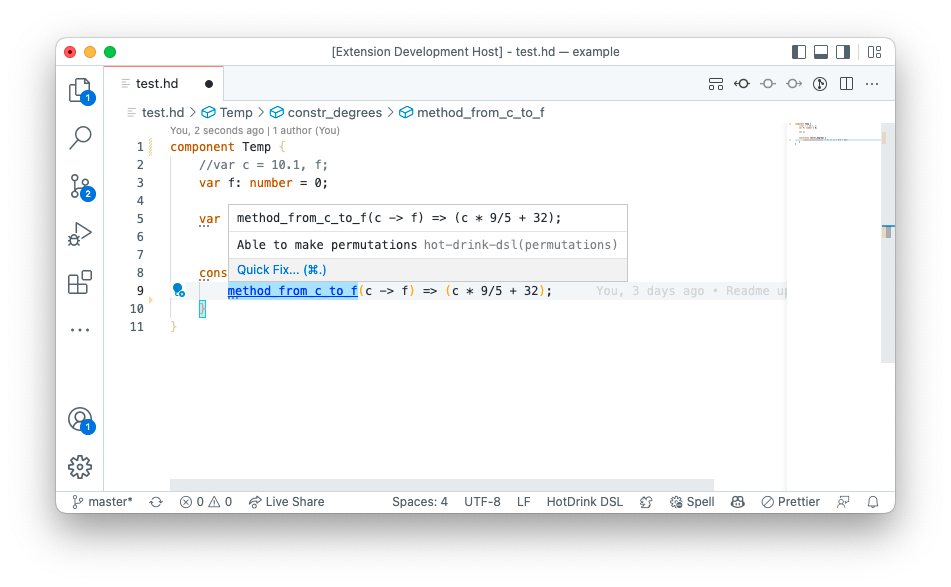
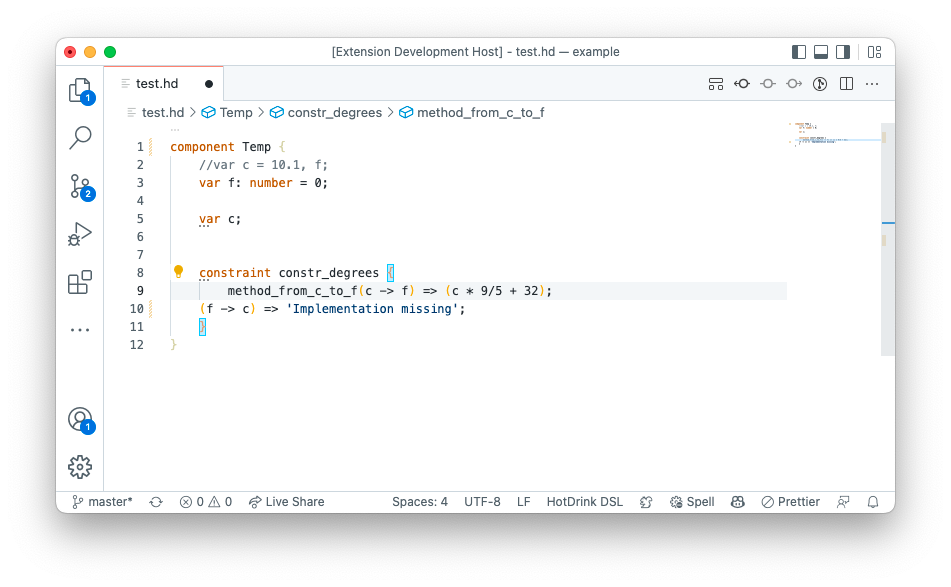

# HotDrink

[](https://marketplace.visualstudio.com/items?itemName=MathiasSkallerudJacobsen.HotDrink-DSL)


This extension adds language support for HotDrink, powered by a language server made in [Langium](https://langium.org). 

## Setup
For the syntax highlighting to work the file need to have the file-suffix `.hd`.
The code generation makes use if the npm package `hot-drink`. To install it to your project run the following command:
```zsh
npm install hotdrink
```

To make the syntax highlighting work the file must have the ending `.hd`

## Features
- Domain Specific Language (DSL) for HotDrink.
- Syntax highlighting for the DSL.
- Validation of the DSL.
- Renaming by reference in the DSL (experimental).
- Graph view of the multi-way dataflow constrain system made, provided by Sprotty.
- Generation of JavaScript code from the DSL.
- Quick fixes for the DSL.
- Demo generation of a HotDrink specification.


### Syntax highlighting
Adds syntax highlighting for the HotDrink DSL. Keywords are colored.


### Validation
Adds errors, hints, and warnings to the editor in the context of HotDrink code. Not all errors, hints, and warnings are implemented just a small set of them.



### Renaming by reference
Should be able to rename variables in the DSL, and that would change all occurrences of that reference. Still experimental due to lack of proper testing.


### Graph view
Adds a graph view of the multi-way dataflow constrain system made, provided by Sprotty.


Green nodes are named *component.constraint*. Blue nodes are method names. Orange nodes are variables. Lines with red dots in each end is a method-to-constraint connection, while the arrows are the dataflow in and out of the method.  

### Generation of JavaScript code from the HotDrink DSL
The extension provides a command to generate JavaScript code from the HotDrink DSL. By pressing `cmd + shift + p` when a HotDrink file (.hd) is active. There is a menu item to generate the code. Type `Generate JavaScript from the current HotDrink DSL file` and click on it. This will generate the JavaScript file inside a folder called `<root>/generated`. The name of the file will be the same as the name of the HotDrink file, but with the extension `.js`.


### Quick fixes
The extension adds quick fixes to some parts of the code. 



### Demo generation of a HotDrink specification
The extension provides a command to generate a demo HotDrink specification. By pressing `cmd + shift + p` when a HotDrink file (.hd) is active. There is a menu item to generate the code. Type `Generate a demo HotDrink specification` and click on it. This will generate the JavaScript and HTML files inside a folder called `<root>/generated`. After that folder is made you need to add [this file](https://github.com/MathiasSJacobsen/HotDrink-DSL/blob/master/hotdrink.js) to the generated folder for the demo to work. 

Then you have to start a web server in the generated folder. If you have python installed you can run the following command in the generated folder:
```zsh
python -m http.server 8000
```
Then you can open the generated HTML file in a browser and see the demo in the browser.


## Release Notes

### 1.0.3
- Bug in generation of imports fixed

### 1.0.2
- Demo now works for all basic data types (number, string, boolean).
- Also small fix when making string variables with API code.

### 1.0.1
- Small fix in the title of demo generation command.

### 1.0.0
- Initial release of HotDrink plugin for VSCode.
- Fixed bug where JavaScript code generation would not have the right index on methods.
- Now a demo can be made from the HotDrink specification.

### 0.3.0
- Fixed that pictures now shows in the README

### 0.2.0
Graph view:
- Removed *Component* from the graph view.
- Renewed the edge between *constraints* and *methods*. Now easier to differentiate between that type of edge, and dataflow edge between *constraints* and *variables*. Also the port between *constraints* and *methods* are red now. 

Readme:
- Added more information about the extension.

Bug fixes:
- Removed some of the output errors, the extension now tolerates more invalid states of the document.

### 0.1.0
Initial release.

***Part of the master theses Development Of Tool Support For A Multiway Dataflow Constraint System Library, at the University of Bergen, Informatics department, Software engineering***


Mathias Skallerud Jacobsen  
[@MathiasSJacobsen](https://github.com/MathiasSJacobsen)